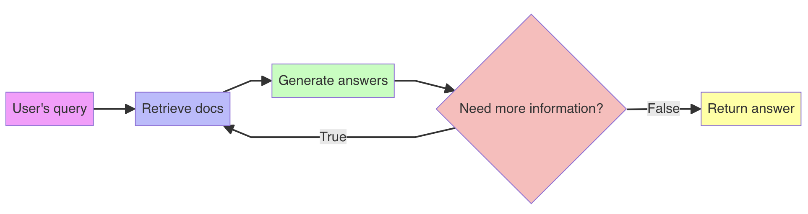
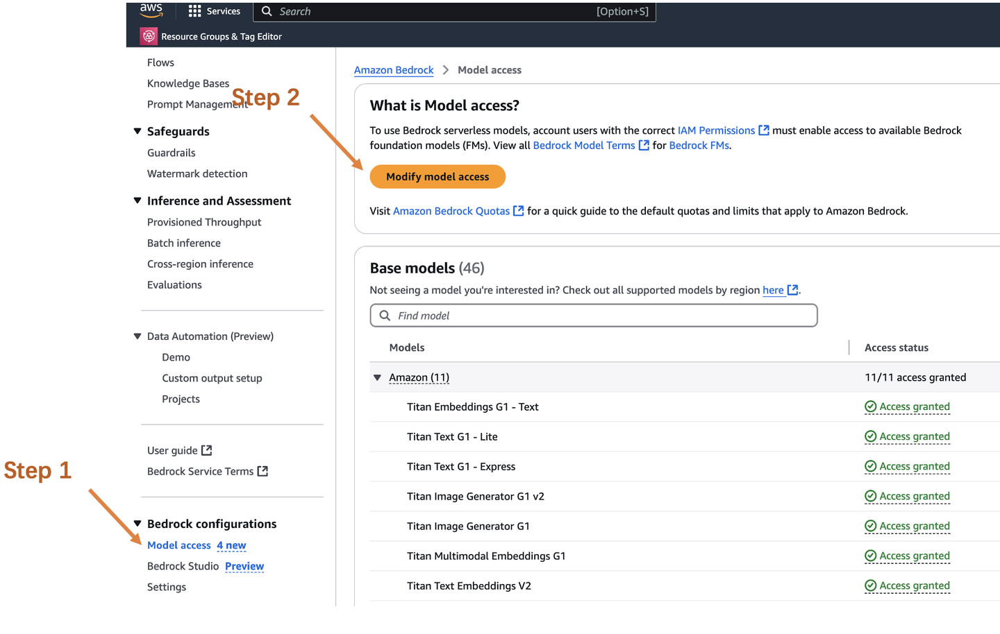

# Building Adaptive RAG Document QA System with LangGraph and AWS Bedrock

It seems that most tutorials available are based on OpenAI API. Despite AWS Bedrock being such a popular service, there aren't many reliable tutorials online, and even the related documentation isn't very comprehensive...

As one of the earliest Bedrock developers, I plan to write a series of practical tutorials about AWS Bedrock to help everyone quickly start using Bedrock.

Let's begin with a document QA system. This system combines LangGraph and AWS Bedrock to quickly and intelligently answer document-related questions. The code isn't complicated but very practical, allowing you to quickly create a workflow and easily modify it according to your needs.

The complete process is as follows:



The project uses the latest Claude 3.5 Sonnet v2 as the LLM and Cohere's multilingual-v3 as the embedding model, both of which are the strongest closed-source models I've used.

## Environment Setup

First, install the necessary dependencies:

```bash
pip install boto3 langchain langgraph chromadb langchain-community langchain-core langchain-aws
```

Configure your AWS account's access key and secret key in CLI using the following code:

```
aws configure
```

Remember to enable permissions for corresponding models in AWS Console!


## Complete Code Implementation

### 1. AWS Configuration and Initialization

```python
import boto3
from langchain_aws import BedrockEmbeddings, ChatBedrock
from langchain.text_splitter import RecursiveCharacterTextSplitter
from langchain_community.vectorstores import Chroma
from langchain_community.document_loaders import TextLoader
from langgraph.graph import StateGraph
from typing import TypedDict
from langchain_core.messages import HumanMessage

# Initialize Bedrock client
bedrock = boto3.client(
    service_name='bedrock-runtime',
    region_name='us-west-2'
)

# Configure Claude model
llm = ChatBedrock(
    model_id="anthropic.claude-3-5-sonnet-20241022-v2:0",
    client=bedrock,
    model_kwargs={
        "max_tokens": 2048,
        "temperature": 0.9,
    }
)

# Configure embedding model
embeddings = BedrockEmbeddings(
    client=bedrock,
    model_id="cohere.embed-multilingual-v3"
)
```

### 2. Document Processing and Vector Storage

```python
# Load documents
loader = TextLoader("english-grammar.txt")
documents = loader.load()

# Text splitting
text_splitter = RecursiveCharacterTextSplitter(
    chunk_size=1000,
    chunk_overlap=100
)

splits = text_splitter.split_documents(documents)

# Create vector database
vectorstore = Chroma.from_documents(
    documents=splits,
    embedding=embeddings
)
```

### 3. Define Workflow Types and States

```python
class AgentState(TypedDict):
    messages: list[str]
    next: str
    question: str
    context: str
    response: str


def should_continue(state: AgentState) -> str:
    messages = state["messages"]
    last_message = messages[-1]

    # Determine if continuation is needed
    if "need more information" in last_message:
        return "continue"
    return "end"
```

### 4. Build Workflow Nodes

```python
def retrieve(state: AgentState) -> AgentState:
    """Retrieve relevant documents"""
    question = state["question"]
    docs = vectorstore.similarity_search(question, k=3)
    context = "\n".join(
        [doc.page_content for doc in docs]
        )
    state["context"] = context
    return state


def generate_response(state: AgentState) -> AgentState:
    """Generate answer"""
    question = state["question"]
    context = state["context"]

    prompt = f"""
    Answer the question based on the following context. If you cannot find the answer in the context, please explicitly state so.

    Context: {context}

    Question: {question}
    """

    # Correct way to call ChatBedrock
    message = HumanMessage(content=prompt)
    response = llm.invoke([message])

    # Get response content
    response_content = response.content

    state["response"] = response_content
    state["messages"].append(response_content)
    return state
```

### 5. Build Workflow Graph

```python
# Create workflow graph
workflow = StateGraph(AgentState)


# Define end node
def end_node(state: AgentState) -> AgentState:
    """End node, return current state directly"""
    return state


# Add nodes
workflow.add_node("retrieve", retrieve)
workflow.add_node("generate", generate_response)
workflow.add_node("end", end_node)  # Add end node

# Add edges and conditions
workflow.add_edge("retrieve", "generate")
workflow.add_conditional_edges(
    "generate",
    should_continue,
    {
        "continue": "retrieve",
        "end": "end"
    }
)

# Set entry and exit points
workflow.set_entry_point("retrieve")
workflow.set_finish_point("end")
```

### 6. Usage Example

```python
# Compile workflow
chain = workflow.compile()

# Process query
response = chain.invoke({
    "question": "What is the main content of the document?",
    "messages": [],
    "context": "",
    "response": "",
    "next": ""
})

print(f"Answer: {response['response']}")
```

## Conclusion

Through the workflow based on AWS Bedrock and LangGraph introduced in this article, you can quickly build and customize your own intelligent QA system. The advantage of this workflow lies in its high customizability.