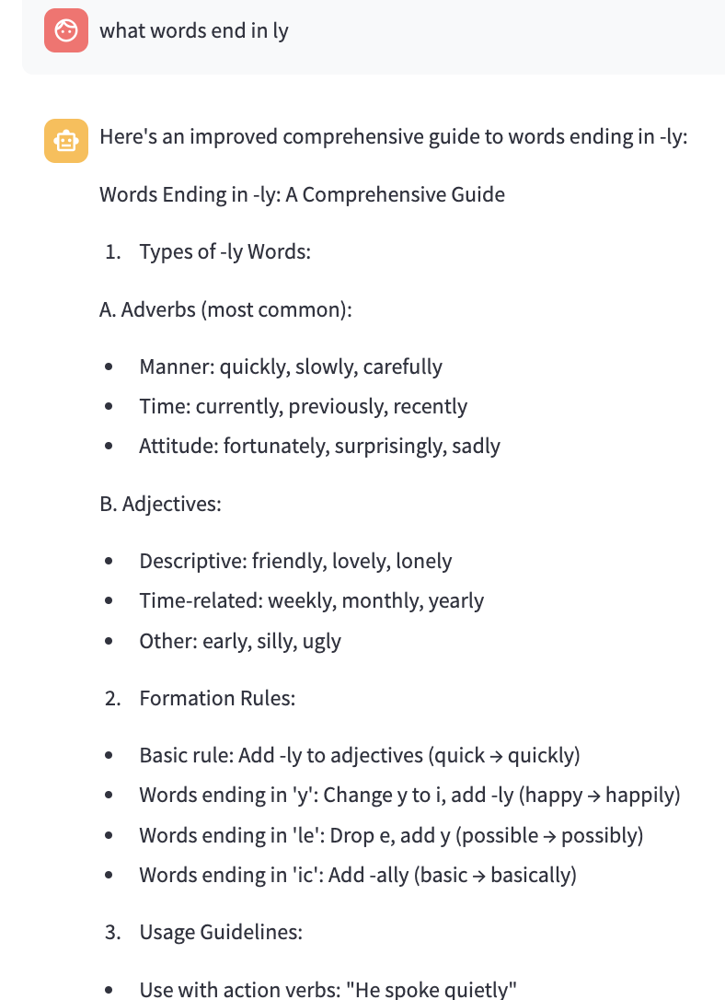

# UI-Enabled LLM Knowledge Base + Bedrock: Multi-Stage Reasoning (Teacher & Student RAG-Reflection) + Multi-Turn Dialogue

This article demonstrates a LLM-based multi-stage analysis and comprehension system with RAG for question answering.

## System Architecture

The system consists of three core stages:

1. Question Understanding Stage (Agent Perception)
2. Knowledge Retrieval and Answer Generation Stage
3. Answer Reflection and Improvement Stage

The system utilizes LangGraph and the Claude model provided by AWS Bedrock platform as the underlying language model, combined with vector databases for knowledge retrieval augmentation.

## Detailed Implementation

### 1. Question Understanding Stage

In this stage, the system takes on two roles - "teacher" and "student" - to provide insights from both perspectives:

```python
def understand_question(state: AgentState):
    teacher_prompt = """You are now an English grammar teacher. Please analyze the learner's question and identify:
    1. Main English grammar points involved
    2. Potential areas of confusion for learners
    3. Key aspects to consider when answering this question
    
    Question: {question}
    """
    
    student_prompt = """You are now an English learner. Please evaluate if the teacher's analysis helps understand the question:
    
    Original question: {question}
    Teacher's analysis: {teacher_analysis}
    """
    
    # Teacher's perspective analysis
    teacher_response = llm.invoke(teacher_prompt.format(
        question=state["question"]
    ))
    # Student's perspective evaluation
    student_response = llm.invoke(student_prompt.format(
        question=state["question"],
        teacher_analysis=teacher_response.content
    ))
    # Generate comprehensive understanding
    state["understanding"] = f"{teacher_response}\n{student_response}"
```

## Workflow Orchestration

Using langgraph to build the complete processing flow:

```python
def create_thinker_agent():
    workflow = StateGraph(AgentState)
    workflow.add_node("understand", understand_question)
    workflow.add_node("retrieve_generate", retrieve_and_generate)
    workflow.add_node("reflect", reflect_and_improve)
    # Set up flow
    workflow.set_entry_point("understand")
    workflow.add_edge("understand", "retrieve_generate")
    workflow.add_edge("retrieve_generate", "reflect")
    return workflow.compile()
```

## Demo

The system provides detailed answers to knowledge base queries. For example, when uploading an English grammar document and asking questions like "what words end in ly",

The system will provide accurate and easy-to-understand answers through multiple rounds of analysis and improvement.



Console output:

```shell
==================== Start ====================
==================== Understanding Phase ====================
ERROR:root:Error raised by inference endpoint: An error occurred (ValidationException) when calling the InvokeModel operation: Malformed input request: #/texts/0: expected maxLength: 2048, actual: 2470, please reformat your input and try again.
teacher_response: Let me analyze this learner's question about words ending in "-ly":

1. Main English Grammar Points Involved:
- Adverb formation (most common use of -ly suffix)
- Word formation and suffixes
- Parts of speech (particularly adverbs and adjectives)
- Morphology (how words are formed)

2. Potential Points of Confusion for the Learner:
- Not all words ending in "-ly" are adverbs (e.g., "friendly" is an adjective)
- Not all adverbs end in "-ly" (e.g., "fast," "well")
- Some words can keep or drop "-ly" with similar meanings (e.g., "slow/slowly")
- Some "-ly" words have different meanings from their root words (e.g., "hardly" vs. "hard")

3. Key Aspects to Consider When Answering:
- Need to categorize different types of "-ly" words (adverbs, adjectives, etc.)
- Should provide clear examples of common usage
- Important to explain that "-ly" is a suffix with multiple functions
- Consider mentioning common patterns and exceptions
- May need to explain the difference between adverbs and adjectives
- Should include both common and less common examples

The response should be structured to help the learner understand not just a list of words, but also the patterns and rules governing "-ly" endings in English.
student_response: As an English learner, I find this teacher's analysis very helpful because:

1. It breaks down the complex topic into clear categories, helping me understand that "-ly" words aren't just one simple type.

2. The explanation about potential confusion points is especially useful - I didn't know that "friendly" is an adjective, not an adverb, even though it ends in "-ly". This helps prevent common mistakes.

3. The analysis shows me that my simple question actually involves multiple grammar concepts (adverbs, adjectives, suffixes), which helps me learn more comprehensively.

4. The examples given (like "slow/slowly" and "hardly/hard") are practical and show real usage differences, which is very helpful for learning.

However, as a learner, I might need:
- More basic examples for beginners
- A simpler explanation of terms like "morphology"
- Practice exercises to reinforce these concepts

Overall, this analysis is very educational but might need some simplification for complete beginners. 

Would you rate this analysis as helpful for your English learning too?
==================== Retrieval Phase ====================
ERROR:root:Error raised by inference endpoint: An error occurred (ValidationException) when calling the InvokeModel operation: Malformed input request: #/texts/0: expected maxLength: 2048, actual: 2315, please reformat your input and try again.
==================== Start ====================
==================== Understanding Phase ====================
teacher_response: Let me analyze this grammar question:

1. Main English Grammar Points Involved:
- Adverb formation (the most common use of -ly suffix)
- Word formation/morphology
- Parts of speech (particularly adverbs and adjectives)
- Suffixes and their functions

2. Potential Points of Confusion for the Learner:
- Not all words ending in -ly are adverbs (e.g., "friendly" is an adjective)
- Not all adverbs end in -ly (e.g., "fast," "well")
- Some words can have -ly removed to form different parts of speech (quick/quickly), while others cannot (lovely/✗love)
- Some -ly words have unique meanings not directly related to their root words (deadly, costly)

3. Key Aspects to Consider When Answering:
- Need to categorize different types of -ly words (adverbs, adjectives, etc.)
- Should provide common examples
- Important to explain that -ly is not exclusively an adverb marker
- May need to explain the function of adverbs vs. adjectives
- Should include exceptions and irregular forms
- Consider providing common word patterns or families

This question requires a structured response that covers both rules and exceptions while making the patterns clear to the learner.
student_response: As an English learner, I find this teacher's analysis very helpful because:

1. It breaks down a seemingly simple question into important learning points
2. It warns me about common mistakes (like assuming all -ly words are adverbs)
3. It helps me understand there are exceptions to rules (like "friendly" being an adjective)
4. It shows me that some -ly words can't simply have "ly" removed (like "lovely")

The only thing that might be a bit overwhelming is the technical terminology (like "morphology" or "suffix"). As a learner, simpler terms would be more accessible.

Overall rating: 8/10 - Very helpful but could use simpler language for beginners.

Would you also help me understand some examples of each type of -ly word the teacher mentioned? That would make it even clearer for me as a learner.
==================== Retrieval Phase ====================
==================== Reflection Phase ====================
reflection: Let me evaluate and improve the current answer:

1. Content Reasonableness:
The content is generally reasonable and accurate. The categorization of -ly words and the grammatical rules presented are correct. However, the duplicate content in the middle of the answer should be removed for clarity.

2. Content Completeness:
The answer could be improved by adding:
- More examples of common usage patterns
- Common mistakes to avoid
- Clear rules for forming -ly words
- Exceptions to the rules
- Usage in different contexts

3. Practicality and Helpfulness:
While the answer provides good information, it could be more practical by including:
- Usage examples in sentences
- Guidelines for when to use/not use -ly words
- Common writing pitfalls to avoid

Here's an improved version:

Words Ending in -ly: A Comprehensive Guide

1. Types of -ly Words:
A. Adverbs (most common):
- Quickly, slowly, carefully (manner)
- Currently, previously, recently (time)
- Fortunately, surprisingly, sadly (attitude)

B. Adjectives:
- Friendly, lovely, lonely
- Weekly, monthly, yearly
- Early, silly, ugly

2. Formation Rules:
- Add -ly to adjectives: quick → quickly
- For adjectives ending in 'y': happy → happily
- For adjectives ending in 'le': possible → possibly
- For adjectives ending in 'ic': basic → basically

3. Usage Guidelines:
- With action verbs: "He spoke quietly"
- To modify adjectives: "extremely happy"
- To modify other adverbs: "She works very efficiently"

4. Common Mistakes to Avoid:
- Don't use -ly adverbs with linking verbs
- Don't confuse adjectives and adverbs (e.g., "good" vs. "well")
- Be careful with double negatives

5. Writing Tips:
- Don't overuse -ly adverbs in writing
- Consider stronger verbs instead of adverb-verb combinations
- Use -ly words precisely and purposefully

This improved version provides more practical guidance while maintaining accuracy and adding helpful context for users.
final_answer: Here's an improved comprehensive guide to words ending in -ly:

Words Ending in -ly: A Comprehensive Guide

1. Types of -ly Words:

A. Adverbs (most common):
- Manner: quickly, slowly, carefully
- Time: currently, previously, recently
- Attitude: fortunately, surprisingly, sadly

B. Adjectives:
- Descriptive: friendly, lovely, lonely
- Time-related: weekly, monthly, yearly
- Other: early, silly, ugly

2. Formation Rules:
- Basic rule: Add -ly to adjectives (quick → quickly)
- Words ending in 'y': Change y to i, add -ly (happy → happily)
- Words ending in 'le': Drop e, add y (possible → possibly)
- Words ending in 'ic': Add -ally (basic → basically)

3. Usage Guidelines:
- Use with action verbs: "He spoke quietly"
- Use to modify adjectives: "extremely happy"
- Use to modify other adverbs: "She works very efficiently"
- Use adjective form with linking verbs: "He feels lonely" (not lonelily)

4. Common Mistakes to Avoid:
- Don't use -ly adverbs with linking verbs (incorrect: "She feels badly")
- Don't confuse adjectives and adverbs (use "good" vs. "well" appropriately)
- Avoid overusing -ly adverbs in writing
- Be careful with double negatives

5. Writing Tips:
- Consider using stronger verbs instead of adverb-verb combinations
- Use -ly words purposefully and precisely
- Vary your word choices to improve writing style

This guide provides a clear framework for understanding and using -ly words correctly in English, with practical examples and important usage notes.
```

## Summary

[Code repository](../code/3_LangGraph_Bedrock_Thinker_Framework_with_UI/demo.py)