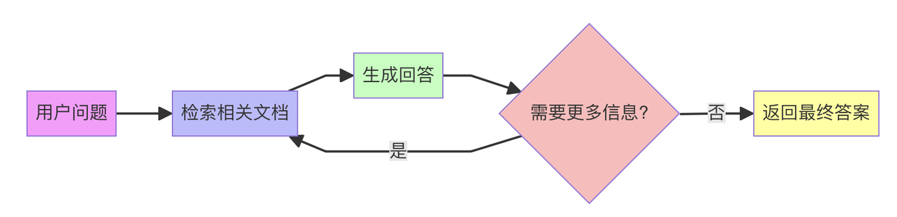

# 使用 LangGraph 和 AWS Bedrock 构建自适应 RAG 文档问答系统

目前市面上的教程貌似都是基于OpenAI API，AWS Bedrock 这么火的service，在网上貌似没多少靠谱教程，甚至相关doc都不是很齐全。。。

作为最早的Bedrock开发者之一，接下来我打算写一系列关于AWS Bedrock的实战教程，方便大家快速把Bedrock用起来。

本文先从一个文档问答系统开始。这个系统结合了LangGraph和AWS Bedrock，可以快速智能地回答文档相关的问题，代码并不复杂，但非常实用，可以快速做出一个workflow，并且可以按照自己的需求，轻松修改成适合自己的workflow。

完整流程如下：



项目中使用的LLM是最新的Claude 3.5 Sonnet v2，embedding model使用的是Cohere的multilingual-v3，都是目前我用过最强的闭源model。

## 环境准备

首先安装必要的依赖：

```bash
pip install boto3 langchain langgraph chromadb langchain-community langchain-core langchain-aws
```

在CLI中使用下面代码配置AWS账号的的access key和secret key。

```
aws configure
```

记得在AWS Console开通对应模型的权限！


## 完整代码实现

### 1. AWS 配置和初始化

```python
import boto3
from langchain_aws import BedrockEmbeddings, ChatBedrock
from langchain.text_splitter import RecursiveCharacterTextSplitter
from langchain_community.vectorstores import Chroma  # 更改导入路径
from langchain_community.document_loaders import TextLoader  # 更改导入路径
from langgraph.graph import StateGraph
from typing import TypedDict
from langchain_core.messages import HumanMessage

# 初始化 Bedrock 客户端
bedrock = boto3.client(
    service_name='bedrock-runtime',
    region_name='us-west-2'
)

# 配置 Claude 模型
llm = ChatBedrock(
    model_id="anthropic.claude-3-5-sonnet-20241022-v2:0",
    client=bedrock,
    model_kwargs={
        "max_tokens": 2048,
        "temperature": 0.9,
    }
)

# 配置嵌入模型
embeddings = BedrockEmbeddings(
    client=bedrock,
    model_id="cohere.embed-multilingual-v3"
)
```


### 2. 文档处理和向量存储

```python
# 加载文档
loader = TextLoader("english-grammar.txt")
documents = loader.load()

# 文本分割
text_splitter = RecursiveCharacterTextSplitter(
    chunk_size=1000,
    chunk_overlap=100
)

splits = text_splitter.split_documents(documents)

# 创建向量数据库
vectorstore = Chroma.from_documents(
    documents=splits,
    embedding=embeddings
)
```

### 3. 定义工作流类型和状态

```python
class AgentState(TypedDict):
    messages: list[str]
    next: str
    question: str
    context: str
    response: str


def should_continue(state: AgentState) -> str:
    messages = state["messages"]
    last_message = messages[-1]

    # 判断是否需要继续对话
    if "需要更多信息" in last_message:
        return "continue"
    return "end"
```

### 4. 构建工作流节点

```python
def retrieve(state: AgentState) -> AgentState:
    """检索相关文档"""
    question = state["question"]
    docs = vectorstore.similarity_search(question, k=3)
    context = "\n".join(
        [doc.page_content for doc in docs]
        )
    state["context"] = context
    return state


def generate_response(state: AgentState) -> AgentState:
    """生成答案"""
    question = state["question"]
    context = state["context"]

    prompt = f"""
    基于以下上下文回答问题。如果无法从上下文中找到答案，请明确说明。

    上下文：{context}

    问题：{question}
    """

    # 使用 ChatBedrock 的正确调用方式
    message = HumanMessage(content=prompt)
    response = llm.invoke([message])

    # 获取响应内容
    response_content = response.content

    state["response"] = response_content
    state["messages"].append(response_content)
    return state
```

### 5. 构建工作流图

```python
# 创建工作流图
workflow = StateGraph(AgentState)


# 定义结束节点
def end_node(state: AgentState) -> AgentState:
    """结束节点，直接返回当前状态"""
    return state


# 添加节点
workflow.add_node("retrieve", retrieve)
workflow.add_node("generate", generate_response)
workflow.add_node("end", end_node)  # 添加结束节点

# 添加边和条件
workflow.add_edge("retrieve", "generate")
workflow.add_conditional_edges(
    "generate",
    should_continue,
    {
        "continue": "retrieve",
        "end": "end"
    }
)

# 设置入口和出口
workflow.set_entry_point("retrieve")
workflow.set_finish_point("end")
```

### 6. 使用示例

```python
# 编译工作流
chain = workflow.compile()

# 处理查询
response = chain.invoke({
    "question": "文档的主要内容是什么?",
    "messages": [],
    "context": "",
    "response": "",
    "next": ""
})

print(f"回答: {response['response']}")
```

## 结束语

通过本文介绍的基于 AWS Bedrock 和 LangGraph 的工作流程，你可以快速基于这个原型来构建并定制自己的智能问答系统。这个工作流的优势在于其高度的可定制性。