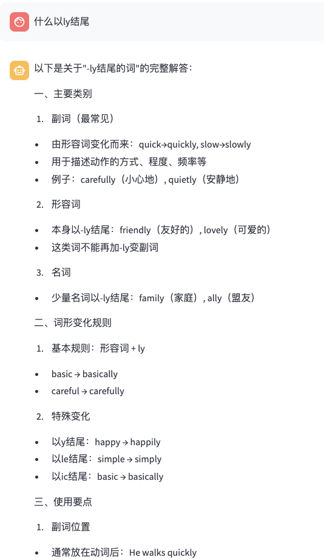

带UI！LLM 知识库+Bedrock—多阶段思考(教师&学生-RAG-反思)+多轮对话

本文分享一个基于LLM的多阶段分析理解+RAG，来回答问题。

## 系统架构

该系统主要包含三个核心阶段:

1. 问题理解阶段(Agent感知)
2. 知识检索与答案生成阶段
3. 答案反思与改进阶段

系统使用LangGraph和AWS Bedrock平台提供的Claude模型作为底层语言模型,并结合向量数据库实现知识检索增强。


## 详细实现

### 1. 问题理解阶段

在这个阶段,系统会分别扮演"教师"和"学生"两个角色，输出两个角度的见解:

```python
def understand_question(state: AgentState):
    teacher_prompt = """你现在是一位语法教师。请分析以下学习者的问题，识别：
    1. 涉及的主要英语语法知识点
    2. 学习者可能的困惑点
    3. 回答这个问题需要考虑的关键方面
    
    问题: {question}
    """
    
    student_prompt = """你现在是一位英语学习者。请评估教师的分析是否有助于理解问题：
    
    原始问题: {question}
    教师分析: {teacher_analysis}
    """
    
    # 教师视角分析问题要点
    teacher_response = llm.invoke(teacher_prompt.format(
        question=state["question"]
    ))
    # 学生视角评估分析的有效性
    student_response = llm.invoke(student_prompt.format(
        question=state["question"],
        teacher_analysis=teacher_response.content
    ))
    # 生成综合理解
    state["understanding"] = f"{teacher_response}\n{student_response}"
```

这种双重视角的设计可以帮助系统更全面地理解学习者的问题，并将见解输入给下一层。

### 2. 知识检索与生成阶段

系统使用向量数据库存储文档的知识,并通过语义检索找到最相关的参考材料:

```python
class KnowledgeBase:
    def __init__(self, docs_path: str):
        # 初始化向量数据库
        self.db = FAISS.from_documents(texts, embeddings)
    
    def retrieve(self, query: str, k: int = 3):
        return self.db.similarity_search(query, k=k)
```

```python
def retrieve_and_generate(state: AgentState) -> AgentState:
    # 结合问题与理解
    query = f"{state['question']}\n{state['understanding']}"
    docs = kb.retrieve(query)
    generation_prompt = """基于以下参考资料和问题理解，生成一个详细的答案：
    
    问题: {question}
    问题理解: {understanding}
    参考资料: {docs}
    """

    response = llm.invoke(generation_prompt.format(
        question=state["question"],
        understanding=state["understanding"],
        docs="\n".join(state["retrieved_docs"])
    ))

    state["current_answer"] = response.content

    return state
```


### 3. 答案反思阶段

系统会从内容合理性、正确性和实用性三个维度对生成的答案进行评估和改进:

```python
def reflect_and_improve(state: AgentState):
    # 多维度评估当前答案
    reflection = llm.invoke(reflection_prompt)
    # 基于评估结果改进
    improvement_prompt = """基于上述反思，请生成改进后的最终答案：
    
    反思结果: {reflection}
    当前答案: {current_answer}
    """
    
    final_answer = llm.invoke(improvement_prompt)
```

## 工作流编排

使用langgraph构建完整的处理流程:

```python
def create_thinker_agent():
    workflow = StateGraph(AgentState)
    workflow.add_node("understand", understand_question)
    workflow.add_node("retrieve_generate", retrieve_and_generate)
    workflow.add_node("reflect", reflect_and_improve)
    # 设置流程
    workflow.set_entry_point("understand")
    workflow.add_edge("understand", "retrieve_generate")
    workflow.add_edge("retrieve_generate", "reflect")
    return workflow.compile()
```

## Demo

系统能够为知识库问题提供详实的解答。例如上传一份英语语法文档，并提问"什么以ly结尾"这样的问题,

系统会通过多轮分析和改进,给出准确且易于理解的答案。



思考流程：

```shell
==================== 开始 ====================
==================== 理解阶段 ====================
teacher_response: 让我帮你分析这个有关"ly结尾"的问题。

1. 涉及的主要语法知识点：
- 副词的构成方法
- 形容词变副词的规则
- 以-ly结尾的词类（副词、形容词）
- 词形变化规则

2. 学习者可能的困惑点：
- 不清楚所有以-ly结尾的词都是副词吗
- 不知道哪些形容词可以加-ly变副词
- 不了解有些词本身就以-ly结尾（如friendly, lovely）是形容词
- 不清楚-ly结尾词的具体用法和功能

3. 回答这个问题需要考虑的关键方面：
- 解释-ly作为后缀的主要功能
- 区分不同词类中的-ly结尾词
- 说明形容词变副词的基本规则
- 提供常见例子
- 说明特殊情况（如一些形容词本身就以-ly结尾）
- 解释词性转换的作用（如何改变词的功能）

建议将这个笼统的问题细化为更具体的方面来回答，如：
- 形容词变副词时加-ly的规则
- 常见的以-ly结尾的副词例子
- 以-ly结尾但不是副词的词
- -ly结尾词在句子中的具体应用
student_response: 作为一名英语学习者,我觉得这位教师的分析非常有帮助,原因如下:

1. 帮助理清思路
- 把笼统的"-ly结尾"问题分类讨论,让我明白这涉及多个知识点
- 特别提醒了不是所有-ly结尾的词都是副词,避免了我可能产生的误解

2. 点出了学习难点
- 指出了我们学习者容易混淆的地方,如有些形容词本来就是-ly结尾
- 提到了特殊情况,提醒我们要注意例外

3. 给出了学习建议
- 建议把大问题拆解成小问题来理解
- 列出了需要掌握的具体知识点
- 强调了要关注实际应用

4. 分析很全面
- 不仅谈词形变化规则
- 还涉及词性转换的功能
- 包含了实际运用的角度

这样的分析框架可以帮助我更系统地学习和理解-ly结尾的相关知识点。建议将问题细分的方式也很实用,让学习更有针对性。
==================== 检索阶段 ====================
retrieve_and_generate: 基于问题和参考资料,我来详细解答"什么以ly结尾"这个问题:

主要是副词(Adverbs)以-ly结尾,具体可以从以下几个方面来说明:

1. 副词的构成
- 最常见的是由形容词加-ly构成
- 例如: quick → quickly, slow → slowly

2. 功能和用法
副词可以修饰:
- 动词: He walks quickly
- 形容词: He is very quick
- 其他副词: He walks too quickly

3. 重要提醒
并非所有以-ly结尾的词都是副词:
- 有些形容词本身就以-ly结尾,如: friendly, lovely
- 有些副词不以-ly结尾,如: soon, very, too

4. 常见例子
常见的以-ly结尾的副词包括:
- quickly (快速地)
- slowly (缓慢地)
- carefully (小心地)
- quietly (安静地)

5. 使用规则
- 通常放在动词后面
- 修饰形容词时放在形容词前面
- 可以与其他副词组合使用

这些-ly结尾的词主要用来描述动作的方式、程度或频率,是英语中表达方式和状态的重要工具。

需要注意的是,参考资料中特别提到:"It often end with -ly, but not always",说明并非所有副词都以-ly结尾,这是一个重要的语法知识点。
==================== 反思阶段 ====================
reflection: 让我从三个方面来评估和改进当前答案：

1. 内容合理性：
- 当前答案基本合理，解释了以-ly结尾的词主要是副词这一核心概念
- 但存在一些不够准确的表述，需要调整

2. 内容完整性：
- 缺少了其他重要的以-ly结尾的词类，如形容词(friendly)、名词(family)等
- 没有说明-ly词尾的词形变化规则
- 缺少特殊情况的说明

3. 实用性和帮助性：
- 例子较少，不够具体
- 缺少实际应用场景
- 练习建议不足

改进建议如下：

一、以-ly结尾的词类别：
1. 副词
- 由形容词变化而来：quick→quickly
- 表示方式、程度、频率等

2. 形容词
- 本身就以-ly结尾：friendly, lovely, lonely
- 不能再加-ly变副词

3. 名词
- family, ally, rally等

二、词形变化规则：
1. 基本规则：形容词 + ly
2. 特殊变化：
- 以y结尾：happy→happily
- 以le结尾：simple→simply
- 以ic结尾：basic→basically

三、使用注意事项：
1. 位置规则
2. 常见错误提醒
3. 实际应用场景

四、练习建议：
1. 造句练习
2. 辨析练习
3. 情境对话

这样的内容结构更加完整，实用性也更强。
final_answer: 以下是关于"-ly结尾的词"的完整解答：

一、主要类别

1. 副词（最常见）
- 由形容词变化而来：quick→quickly, slow→slowly
- 用于描述动作的方式、程度、频率等
- 例子：carefully（小心地）, quietly（安静地）

2. 形容词
- 本身以-ly结尾：friendly（友好的）, lovely（可爱的）
- 这类词不能再加-ly变副词

3. 名词
- 少量名词以-ly结尾：family（家庭）, ally（盟友）

二、词形变化规则

1. 基本规则：形容词 + ly
- basic → basically
- careful → carefully

2. 特殊变化
- 以y结尾：happy → happily
- 以le结尾：simple → simply
- 以ic结尾：basic → basically

三、使用要点

1. 副词位置
- 通常放在动词后：He walks quickly
- 修饰形容词时放在前面：extremely happy
- 修饰整句时可放句首：Fortunately, we arrived on time

2. 常见用法
- 描述方式：speak quietly
- 表示频率：frequently visit
- 表示程度：completely different

3. 注意事项
- 并非所有副词都以-ly结尾（如：fast, hard）
- 有些-ly词可能是不同词类
- 注意语境判断词性

四、练习建议
- 造句练习：使用-ly词造完整句子
- 词类转换练习：形容词变副词
- 在日常交流中多加运用

通过掌握这些规则和用法，可以更准确地使用-ly结尾的词，提高英语表达的准确性和丰富性。
```

## 总结

[代码地址](../code/3_LangGraph_Bedrock_Thinker_Framework_with_UI/demo_cn.py)

